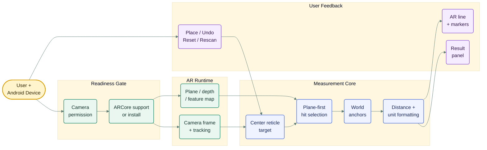

# AR Room Measuring Helper

<p align="center">
  <strong>Reticle-based ARCore distance measuring for Android, built with Kotlin and XML Views.</strong>
</p>

<p align="center">
  
  
  
</p>


AR Room Measuring Helper is an Android AR measuring app that lets a user scan a real room, aim with a center reticle, place two AR points, and read an approximate real-world distance. It is built for the small but satisfying moment where AR feels useful: point, place, compare, and move on.

The project is intentionally grounded in a stable ARCore flow: plane-first hit testing, optional Depth API fallback, clear measurement controls, and a UI that avoids overclaiming precision.

> [!IMPORTANT]
> This app is an AR measuring helper, not a replacement for professional measuring tools. Accuracy depends on tracking quality, lighting, surface texture, device support, and user movement.

## Contents


- [Experience Goals](#experience-goals)
- [Feature Highlights](#feature-highlights)
- [How It Works](#how-it-works)
- [Architecture](#architecture)
- [Project Structure](#project-structure)
- [Source Code Map](#source-code-map)
- [Requirements](#requirements)
- [Run The App](#run-the-app)
- [Accuracy Notes](#accuracy-notes)
- [Current State](#current-state)

## Experience Goals

The next version is not just about adding more buttons. It is about making the measuring flow feel calmer, clearer, and easier to trust.

| Goal | Product direction |
| --- | --- |
| 📐 Measure with intent | The reticle is the main interaction point, so placement feels deliberate instead of accidental. |
| 🧭 Guide without shouting | Status, surface, and readiness cues should help the user without filling the screen with instructions. |
| ✨ Stay visually light | The AR camera remains the star; controls should support the task, not compete with the room view. |
| 🛠️ Prefer stable behavior | Plane-first measurement stays the baseline before more advanced AR experiments are added. |

## Feature Highlights

| Feature | Experience |
| --- | --- |
| Reticle-based measuring | The user aims with a fixed center reticle and presses `Place Point`, keeping camera movement separate from measurement placement. |
| Stable AR hit selection | The app prefers plane hits first, Depth API hits second when available, and feature points only as the final fallback. |
| Clean result panel | The AR screen focuses on one measurement at a time, with a large approximate result, compact controls, and a separate `Rescan` action. |
| Unit conversion | The measured value is stored in meters, then displayed as meters, centimeters, feet, or inches without recalculating anchors. |

Changing units does not recalculate anchors or rerun AR hit tests.

## How It Works

The user flow is simple:

```text
Home screen
  -> Camera permission
  -> ARCore support/install check
  -> AR camera view
  -> Scan surfaces
  -> Aim reticle
  -> Place first point
  -> Place second point
  -> Show approximate distance
```

Distance is calculated from ARCore world coordinates. ARCore poses are in meters, so the app reads the two anchor positions and computes a 3D Euclidean distance:

```kotlin
sqrt(dx * dx + dy * dy + dz * dz)
```

The measured value is displayed as an approximate result because AR tracking is probabilistic and device/environment dependent.

## Architecture

The app is organized as a small AR measurement pipeline rather than a heavy multi-module system. The main design goal is to keep the camera, AR tracking, measurement state, and UI feedback clearly separated.



| Layer | Responsibility |
| --- | --- |
| Readiness gate | Handles camera permission, ARCore support, and install/update prompts before entering AR. |
| AR runtime | Owns the live AR session, camera feed, tracking state, detected surfaces, and optional depth data. |
| Targeting loop | Uses the center reticle to choose one intended point instead of treating every screen tap as measurement input. |
| Measurement state | Stores anchors, calculates distance from world coordinates, and keeps unit conversion separate from AR hit testing. |
| Presentation | Shows the camera, reticle, projected line, status cues, result panel, and measuring controls. |

## Project Structure

```text
AR-Measure/
+-- app/
|   +-- src/main/
|   |   +-- AndroidManifest.xml
|   |   +-- java/com/example/ARMeasure/
|   |   |   +-- MainActivity.kt
|   |   |   +-- ar/
|   |   |       +-- ARMeasureActivity.kt
|   |   |       +-- BackgroundRenderer.kt
|   |   |       +-- MeasurementOverlayView.kt
|   |   +-- res/
|   |       +-- layout/
|   |       +-- drawable/
|   |       +-- color/
|   |       +-- values/
+-- docs/
|   +-- stage-01-mvp-foundation-report.md
|   +-- stage-02-real-app-roadmap.md
+-- gradle/libs.versions.toml
```

## Source Code Map

| File | Role |
| --- | --- |
| [`MainActivity.kt`](app/src/main/java/com/example/ARMeasure/MainActivity.kt) | Entry screen, camera permission handling, ARCore availability/install checks |
| [`ARMeasureActivity.kt`](app/src/main/java/com/example/ARMeasure/ar/ARMeasureActivity.kt) | ARCore session lifecycle, point placement, hit selection, anchors, unit formatting, measurement controls |
| [`BackgroundRenderer.kt`](app/src/main/java/com/example/ARMeasure/ar/BackgroundRenderer.kt) | OpenGL camera background rendering for the AR view |
| [`MeasurementOverlayView.kt`](app/src/main/java/com/example/ARMeasure/ar/MeasurementOverlayView.kt) | 2D projected markers and line overlay for placed AR points |
| [`activity_main.xml`](app/src/main/res/layout/activity_main.xml) | Home screen layout |
| [`activity_ar_measure.xml`](app/src/main/res/layout/activity_ar_measure.xml) | AR measuring screen layout |

## Requirements

| Requirement | Notes |
| --- | --- |
| Android Studio | Recommended development environment |
| Kotlin Android support | Project language is Kotlin |
| Real ARCore device | Required for meaningful AR behavior testing |
| Camera permission | Requested before AR measurement starts |
| Google Play Services for AR | Installed or updated through the ARCore flow |
| Minimum SDK | `29` |
| ARCore dependency | `com.google.ar:core:1.54.0` |

> AR behavior should be tested on a real supported device. Emulator testing is not enough for validating measurement quality.

## Run The App

1. Open the project folder in Android Studio.
2. Let Gradle sync.
3. Connect an ARCore-supported Android device.
4. Run the `app` configuration.
5. Grant camera permission.
6. If prompted, install or update Google Play Services for AR.

## Accuracy Notes

> [!TIP]
> The best measurements usually come from slow camera movement, visible surface texture, and placing both points on the same intended object or plane.

| Better results | Current limits |
| --- | --- |
| Move the phone slowly. | The measurement line is a 2D overlay projection, not a full 3D rendered object. |
| Prefer textured, well-lit surfaces. | Depth API support depends on the device. |
| Place both points on the same intended object or surface. | Manual tap-to-focus is not implemented. |
| Start with walls, floors, and tables before trying small objects. | Plane-boundary visualization is intentionally not shown because it was visually misleading in earlier iterations. |
| Use `Rescan` if scale, tracking, or detected surfaces feel unreliable. | Measurements are approximate and should be treated as guidance, not certified dimensions. |

## Current State

The project has moved beyond the first MVP and is now in Stage 2 UI/UX and practical feature expansion.

**Implementation checklist**

- ✅ ARCore session startup
- ✅ Camera permission flow
- ✅ ARCore availability and install checks
- ✅ Horizontal and vertical plane detection
- ✅ Center-reticle point placement
- ✅ Two-point distance measurement
- ✅ Optional Depth API support when available on the device
- ✅ Unit selector for meters, centimeters, feet, and inches
- ✅ Undo, Reset, and Rescan controls
- ⏳ Multiple segment path mode
- ⏳ Lightweight share result
- 🧭 Area and height modes for a later stage


## Development Philosophy

This project deliberately prefers stable AR behavior over visual tricks. The most important design rule is that the user should understand what the app is doing:

- scan first
- aim deliberately
- place points explicitly
- show approximate results honestly
- keep advanced features hidden until they are needed

That makes the app slower to overpromise, but much easier to trust.
